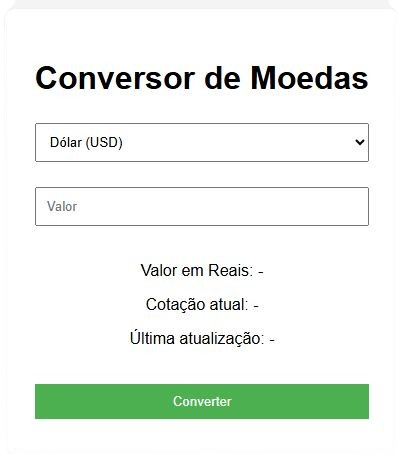

## 🚀 Como Usar

1. **Clone ou baixe** este repositório.
2. **Abra o arquivo `index.html`** em um navegador moderno.
3. **Selecione a moeda** de origem (USD ou BTC).
4. **Digite o valor** que deseja converter.
5. Clique no botão **"Converter"** e veja o resultado em reais, a cotação atual e a última atualização.

## 📸 Demonstração

 <!-- opcional, se quiser adicionar uma imagem -->

## 🔧 Melhorias Futuras

- Adicionar mais moedas (EUR, ARS, etc).
- Layout responsivo para dispositivos móveis.
- Suporte a múltiplos idiomas.

## 📝 Licença

Este projeto está sob a licença MIT. Veja o arquivo [LICENSE](LICENSE) para mais detalhes.

---

Feito com 💚 por [Seu Nome](https://github.com/alemaodacapa)
